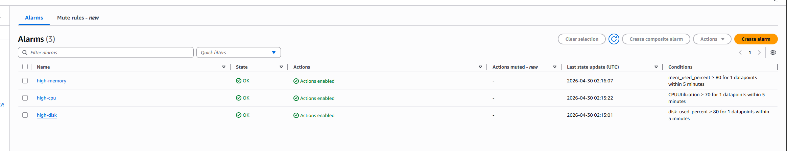
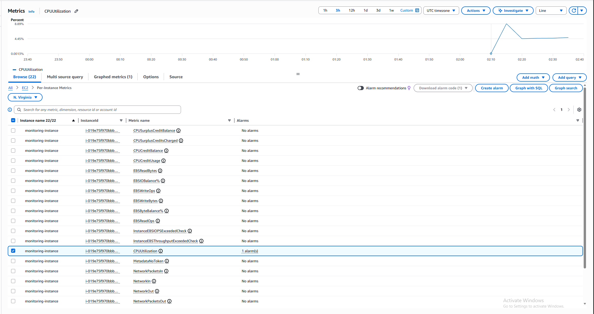
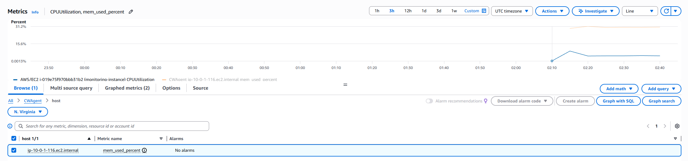
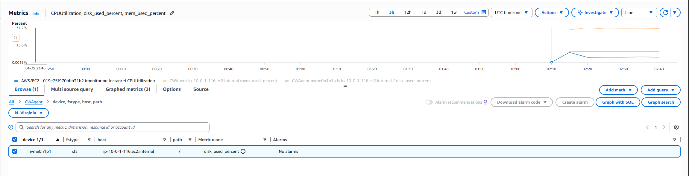
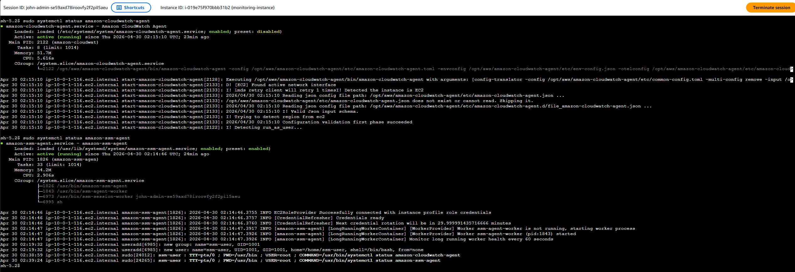
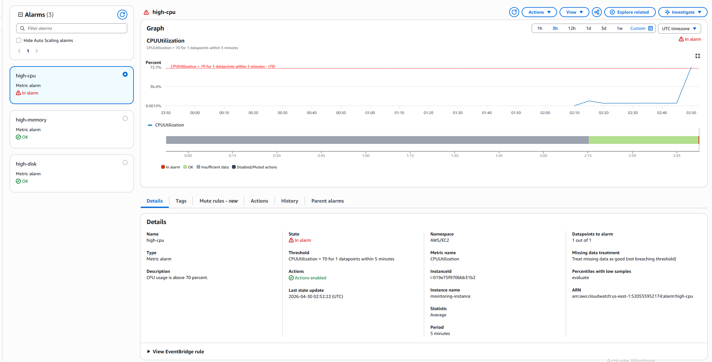

# AWS EC2 Monitoring with CloudWatch, SSM, and Terraform

## Overview

This project provisions an EC2 instance and sets up monitoring using CloudWatch. It collects CPU, memory, and disk metrics, triggers alarms based on thresholds, and sends email notifications through SNS.

All infrastructure is created using Terraform.

---

## What this project does

* Creates a VPC and public subnet
* Launches an EC2 instance (Amazon Linux)
* Configures IAM role for SSM and CloudWatch
* Installs CloudWatch Agent
* Collects system metrics:

  * CPU (default EC2 metric)
  * Memory
  * Disk usage
* Creates CloudWatch alarms
* Sends email alerts using SNS
* Allows access via Systems Manager (no SSH)

---

## Architecture

```text
Terraform
   ↓
EC2 Instance
   ↓
CloudWatch Agent
   ↓
Metrics (CPU, Memory, Disk)
   ↓
CloudWatch Alarms
   ↓
SNS
   ↓
Email Notification
```

---

## Technologies

* Terraform
* AWS EC2
* AWS CloudWatch + CloudWatch Agent
* AWS Systems Manager (SSM)
* AWS SNS

---

## Setup

### 1. Configure variables

```hcl
alert_email = "your-email@example.com"
```

---

### 2. Configure AWS credentials

```powershell
aws configure
```

Set region to:

```text
us-east-1
```

---

### 3. Deploy infrastructure

```powershell
terraform init
terraform apply
```

---

### 4. Confirm SNS subscription

After deployment, confirm the email subscription from AWS.

---

## Accessing the instance

```text
EC2 → Instances → Select instance → Connect → Session Manager
```

---

## Testing the monitoring

Inside Session Manager:

```bash
stress --cpu 2 --timeout 300
```

Then check:

```text
CloudWatch → Alarms
```

The `high-cpu` alarm should transition to **In alarm**.

---

## Validation / Proof

### CloudWatch Alarms

Shows all alarms configured and active.



---

### CloudWatch Metrics

#### CPU Utilization

```text
CloudWatch → Metrics → AWS/EC2 → Per-Instance Metrics → CPUUtilization
```



---

#### Memory Usage

```text
CloudWatch → Metrics → CWAgent → InstanceId → mem_used_percent
```



---

#### Disk Usage

```text
CloudWatch → Metrics → CWAgent → InstanceId,path,fstype → disk_used_percent
```



---

### Session Manager Access

Instance accessed without SSH using SSM.



---

### Alarm Trigger (Optional)

CPU alarm triggered after stress test.



---

## Cleanup

```powershell
terraform destroy
```

## Notes

* CPU metrics are provided by EC2 by default
* Memory and disk metrics are collected using CloudWatch Agent
* No SSH access is required
* Designed to demonstrate monitoring and alerting concepts

---

## Possible improvements

* Add CloudWatch dashboards
* Monitor multiple instances
* Add logging with CloudWatch Logs
* Use Terraform modules for reusability
